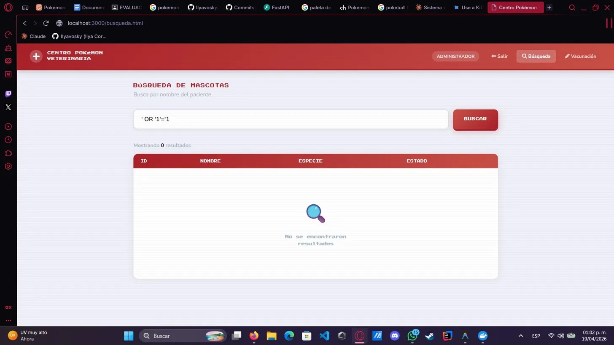
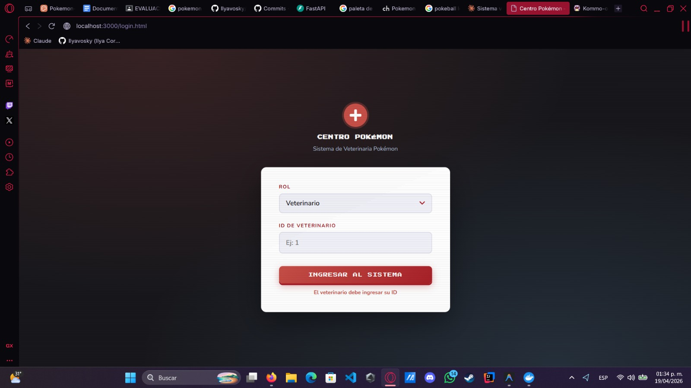
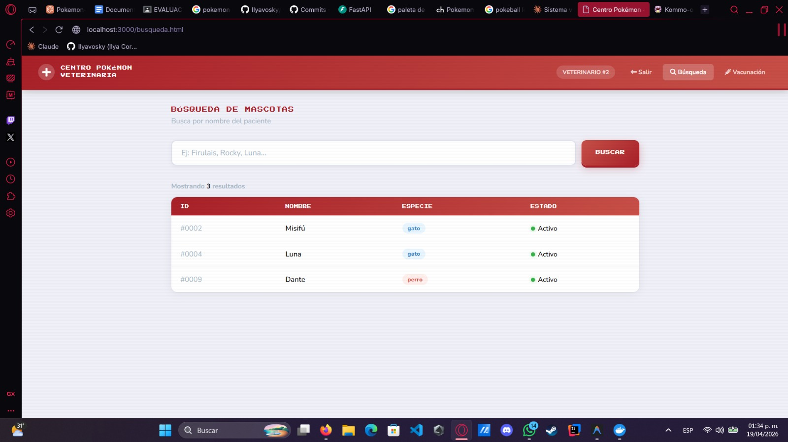
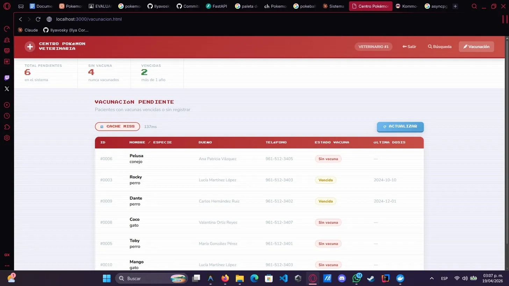
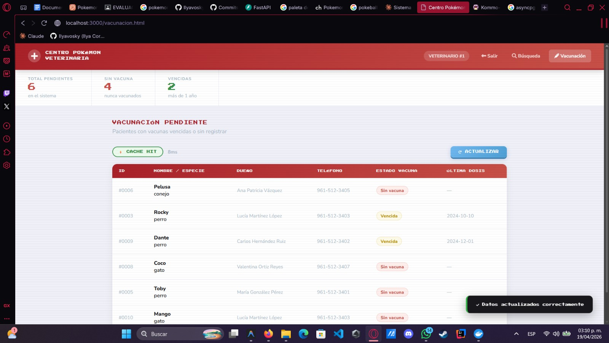

# Cuaderno de Ataques — Centro Pokémon Veterinaria

**Base de Datos Avanzadas · Corte 3 · UP Chiapas · Abril 2026**
**Ilya Cortés Ruiz**
**Matrícula: 243710**
**5to Cuatrimestre -Grupo C**
**Fecha: 19/04/2026**

---

## Sección 1: Tres ataques de SQL Injection que fallan

### Ataque 1 — Quote-escape clásico

**Input exacto probado:**

```
' OR '1'='1
```

**Pantalla:** Búsqueda de mascotas (`http://localhost:3000/busqueda.html`) logueado como `rol_administrador`.

**Resultado:** 0 resultados. El sistema no retornó ninguna mascota ni reveló datos adicionales.

**Evidencia**


**Línea exacta que defendió:**

El archivo se encuentra en la ruta `api/services/mascotas.py`

La función es `buscar()`:

```python
rows = await conn.fetch(
    "SELECT * FROM mascotas WHERE activo = TRUE AND nombre ILIKE $1",
    f"%{q}%"
)
```

El $1 de la query separa la instrucción SQL del dato del usuario. El input del atacante nunca toca la query y va directo como valor de búsqueda. PostgreSQL lo recibe como texto, no como instrucción.

---

### Ataque 2 — Stacked query

**Input exacto probado:**

```
'; DROP TABLE mascotas; --
```

**Pantalla:** Búsqueda de mascotas (`http://localhost:3000/busqueda.html`) logueado como `rol_administrador`.

**Resultado:** 0 resultados. La tabla `mascotas` no fue eliminada — una búsqueda posterior de `Firulais` retornó el registro correctamente.

**Evidencia**


**Línea exacta que defendió:**

El archivo se encuentra en la ruta `api/services/mascotas.py`

La función es `buscar()`:

```python
rows = await conn.fetch(
    "SELECT * FROM mascotas WHERE activo = TRUE AND nombre ILIKE $1",
    f"%{q}%"
)
```

Usando asyncpg, la query y el valor se envían por separado. PostgreSQL analizó la estructura del SQL antes de recibir el input, por lo que cuando llega '; DROP TABLE mascotas; --, ya es demasiado tarde para modificar la query. Todo el texto se trata como el nombre a buscar, no como comandos.

---

### Ataque 3 — Union-based

**Input exacto probado:**

```
' UNION SELECT id, nombre, especie, NULL, NULL, NULL FROM mascotas --
```

**Pantalla:** Búsqueda de mascotas (`http://localhost:3000/busqueda.html`) logueado como `rol_administrador`.

**Resultado:** 0 resultados. El UNION no fue ejecutado como SQL — el input completo fue tratado como valor de búsqueda ILIKE.

**Evidencia**


**Línea exacta que defendió:**

El archivo se encuentra en la ruta `api/services/mascotas.py`

La función es `buscar()`:

```python
rows = await conn.fetch(
    "SELECT * FROM mascotas WHERE activo = TRUE AND nombre ILIKE $1",
    f"%{q}%"
)
```

La query está completamente definida antes de recibir el input del usuario. asyncpg no permite que el valor de `$1` modifique la estructura de la query.

---

## Sección 2: Demostración de RLS en acción

**Setup:** Dos veterinarios con mascotas asignadas según `vet_atiende_mascota`:

- `vet_id=1` (Dr. López): Firulais, Toby, Max
- `vet_id=2` (Dra. García): Misifú, Luna, Dante

**Verificar que los veterinarios tienen que acceder con un id**
**Evidencia**


### Veterinario #1 — vet_id=1

Login con `rol_veterinario`, `vet_id=1`. Búsqueda sin filtro (todas las mascotas):

**Resultado:** 3 mascotas — Firulais (#0001), Toby (#0005), Max (#0007).

**Evidencia**


### Veterinario #2 — vet_id=2

Login con `rol_veterinario`, `vet_id=2`. Misma búsqueda sin filtro:

**Resultado:** 3 mascotas distintas — Misifú (#0002), Luna (#0004), Dante (#0009).

**Evidencia**


### Política RLS que produce este comportamiento

`migrations/06_rls.sql`:

```sql
CREATE POLICY pol_mascotas_vet ON mascotas
FOR SELECT TO rol_veterinario
USING (
    id IN (
        SELECT mascota_id FROM vet_atiende_mascota
        WHERE vet_id = current_setting('app.current_vet_id')::INT
    )
);
```

Cada vez que llega un request, el backend le dice a PostgreSQL dos cosas: qué rol está usando y qué veterinario es (`SET LOCAL ROLE rol_veterinario` y `SET LOCAL app.current_vet_id = {vet_id}`). Con esa información, PostgreSQL revisa cada fila de la tabla y solo deja pasar las mascotas asignadas a ese veterinario (El `id` que aparece en `vet_atiende_mascota`). El LOCAL hace que esa configuración desaparezca al terminar la consulta, evitando que se filtre entre requests.

---

## Sección 3: Demostración de caché Redis funcionando

**Key usada:** `vacunacion_pendiente`
**TTL:** 300 segundos (5 minutos)
**Estrategia de invalidación:** delete-on-write — cuando se aplica una vacuna nueva, el endpoint `POST /vacunas/aplicar` ejecuta `redis.delete(CACHE_KEY)` inmediatamente.

### Primera consulta — CACHE MISS

Primera carga de `http://localhost:3000/vacunacion.html`:

- Badge: `CACHE MISS`
- Latencia: 137ms (consulta a PostgreSQL)

**Evidencia**


## Segunda consulta — CACHE HIT

Click en botón ACTUALIZAR inmediatamente después:

Badge: CACHE HIT
Latencia: 38ms → 8ms (datos desde Redis)

## Por qué TTL de 5 minutos

Consultar vacunación pendiente es costoso — recorre todas las mascotas y todas sus vacunas. Como esos datos no cambian cada segundo, tiene sentido guardarlos en caché 5 minutos.
Si el TTL fuera muy corto (5 segundos), el caché no serviría de nada. Si fuera muy largo (1 hora), un paciente recién vacunado seguiría apareciendo como pendiente, lo cual sería un error clínico.
Por eso también se borra el caché manualmente cada vez que se aplica una vacuna — así los datos siempre son correctos sin importar el TTL.

**Evidencia**

